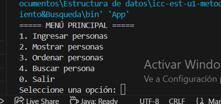
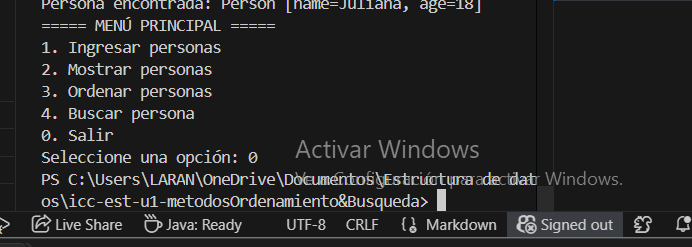

# Métodos de Ordenamiento y Búsqueda en Java (MVC)

## Estudiante: Juliana Torres

Este proyecto implementa algoritmos de **ordenamiento** y **búsqueda binaria** aplicados a objetos `Person` (con nombre y edad), siguiendo el patrón **Modelo-Vista-Controlador (MVC)**.  
Forma parte de la práctica de laboratorio de la asignatura **Estructura de Datos** en la Universidad Politécnica Salesiana.

---

## 📂 Estructura del Proyecto

- **models.Person**  
  Clase que representa a una persona con atributos `name` y `age`.

- **views.View**  
  Maneja la interacción con el usuario mediante consola.  
  Métodos principales: `showMenu()`, `inputPerson()`, `displayPersons()`, `displaySearchResult()`, `inputAge()`, `inputName()`.

- **controllers.SortingMethods**  
  Contiene los algoritmos de ordenamiento:  
  - Burbuja por nombre (`sortByNameWithBubble`)  
  - Selección descendente por nombre (`sortByNameWithSelectionDes`)  
  - Inserción por edad (`sortByAgeWithInsertion`)  
  - Inserción por nombre (`sortByNameWithInsertion`)

- **controllers.SearchMethods**  
  Contiene los algoritmos de búsqueda binaria y validación:  
  - `binarySearchByAge`  
  - `binarySearchByName`  
  - `isSortedByAge`  
  - `isSortedByName`

- **controllers.Controller**  
  Coordina el flujo de la aplicación: ingreso de personas, ordenamiento, búsqueda y visualización.

- **app.Main**  
  Punto de entrada del programa. Crea las instancias de `View`, `SortingMethods`, `SearchMethods` y `Controller`, y ejecuta `controller.start()`.

---

## 🚀 Ejecución

